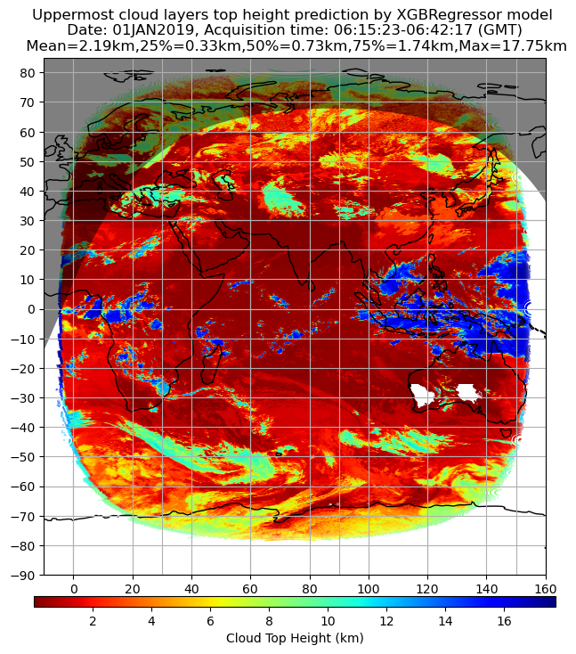
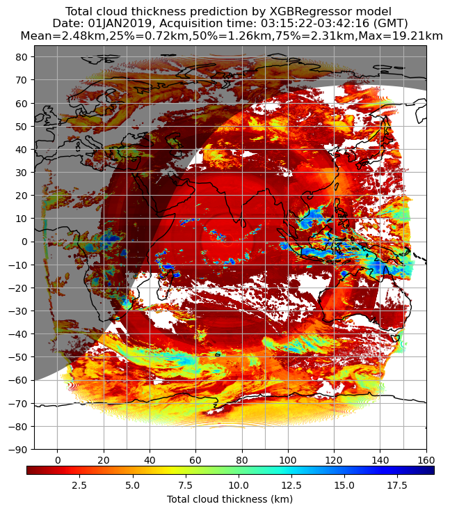
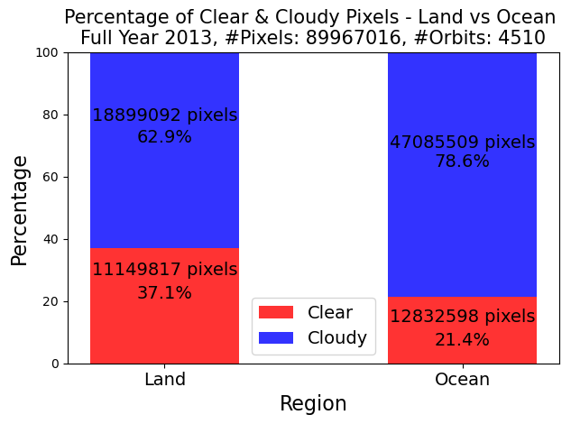
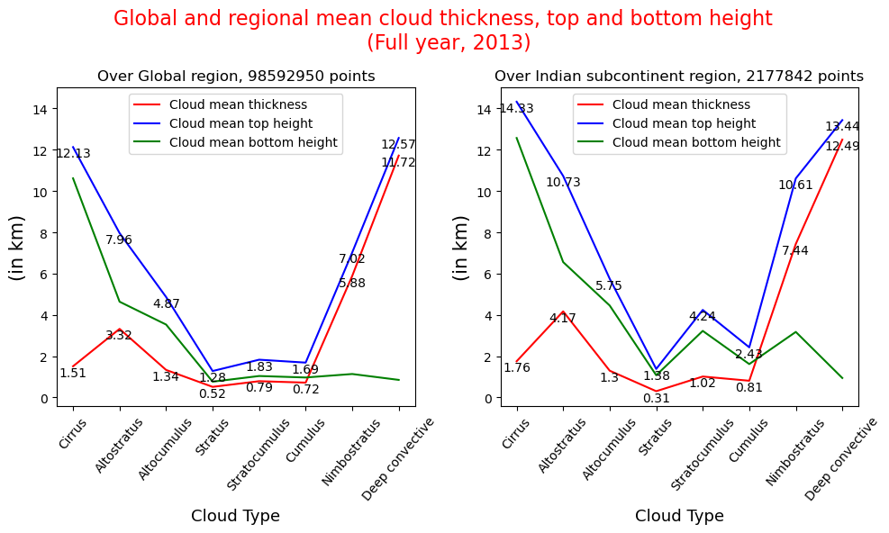
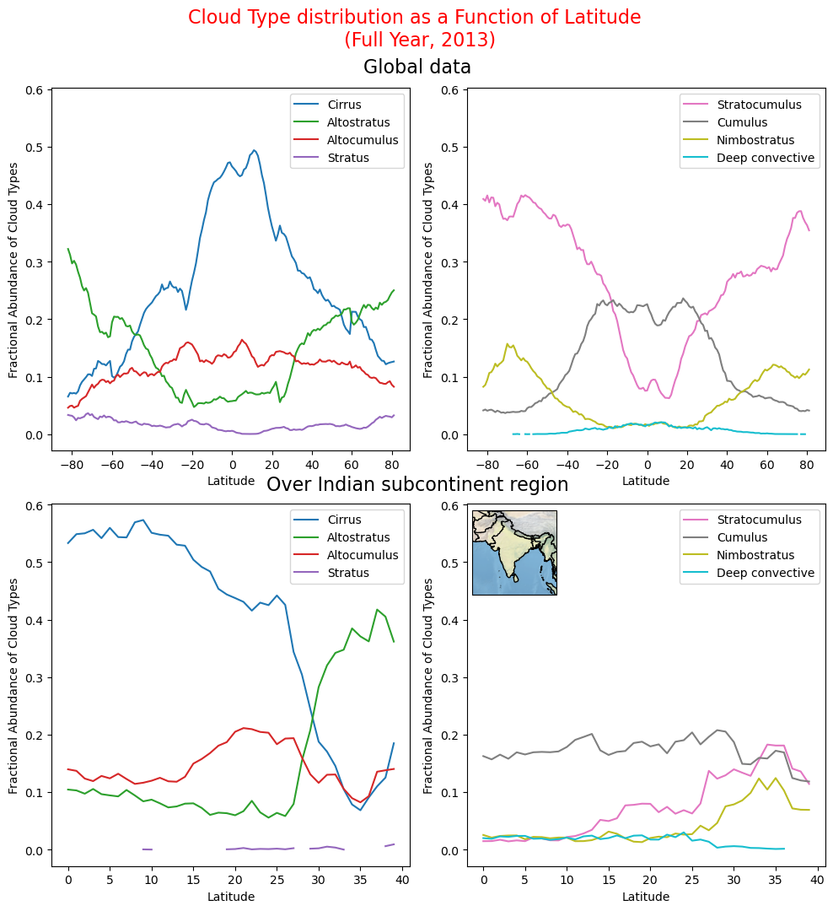

# Title - Retrieval of Earth's Atmospheric Properties using INSAT-3DR satellite data
This repository consists of codes I wrote for my MSc thesis work. 

## AIM
### 1) To retrieve cloud properties using the LEVEL-1/L1 radiometric data from INSAT-3DR geostationary satellite.  
### 2) To study properties and distribution of clouds based on the CloudSat data.

## Motivation
INSAT-3DR produces full-disk image of the Indian side of the globe, every half an hour with a resolution of 1km, 4km and 8km, depending on the channel [(example)](https://github.com/DebasishDhal/Thesis_Repository/blob/main/miscellaneous/images/Allchannelsplot.png). This is the just the radiometric data. In order to retrieve cloud-properties from it, it needs to be processed. If we are succesful in retrieving cloud-properties from INSAT-3DR radiometric data, we can have new full-disk maps of cloud-properties every half an hour. By cloud-properties , I refer to Cloudy/Clear classification, Cloud top height and Cloud total thickness regression. Cloud top height is the top height of the uppermost cloud layer and cloud total thickness is the sum of thickness of all cloud layers present over an area. Here, the unit size of area or the pixel size is 4  km × 4 km.

## Challenge - How to retrieve cloud properties from radiometric data?
INSAT-3DR, like all satellites that employ passive scanning, does not measure any meteorological parameter directly. The emitted/reflected photons incident upon its sensors are measured in terms of counts. It is our job to retrieve useful meteorological properties from the radiometric readings(or counts). 

## Solution
CloudSat, a NASA-operated polar satellite dedicated for observations of clouds, measures all the cloud-properties that we want to retrieve. This makes our task simple and complicated at the same time, but atleast that's a start. CloudSat is a polar satellite, it means CloudSat orbits around earth, scanning the section of the atmosphere just below it (instantenous pixel size is approximately 1.3 km × 1.7 km). So, we have full-disk radiometric data from INSAT-3DR and cloud-related data from CloudSat concentrated on thin lines along the CloudSat orbits. This is shown in the image below, where for a given day all the CloudSat orbits are shown superimposed with the INSAT-3DR coverage area.

  

The cloud-related data from CloudSat was collocated against the radiometric readings from INSAT-3DR.  Collocation is defined as using two or more satellites to get complimentary data of a given place, at a given time. This gives us a dataset which related the radiometric data with the cloud-properties. For example, a cloudy pixel will have a smaller brightness temperature and higher albedo, as compared to a clear pixel. The resulting combined data was processed and fed into ML algorigthms (XGBoost and Random Forest), to produce models that can predict cloudy/clear classificaiton, cloud top height and cloud total height from INSAT-3DR radiometric data alone.

## Collocation process
Here the goal is to collocate pixels from both satellites that are spatially and temporally close by, and collect radiometric data of the pixel from INSAT-3DR file and cloud-related data from the CloudSat file. Collocations folder contains collocation codes for INSAT-3DR 1B-IMAGER and CloudSat 2B-CLDCLASS data. I've included codes to collocate one file at a time and files of entire day at a time (fully automated). In the examples, there's an example notebook containing 3 cells. Each contains code for single file collocation. In the first 2 cells, the permission to collocate was denied, while it was granted in the 3rd cell. This process has been fully automated in the fulldaycollocation code. For an entire day it takes around 40-120 hours. Visit the [collocation folder](https://github.com/DebasishDhal/Thesis_Repository/tree/main/collocations) for more information.

The goal of the collocation process is to generate a dataset which has radiometric data against the correponding cloud-related data. The cloud-related data includes (No. of separate cloud layers, their top and base height, type). Thus it gives us relation between radiometric data and cloud-related data. Below is a map used in the manual collocation process. **In the map below, the datetime in which CloudSat passes over INSAT-3DR coverage area matches with the acquisition datetime of the INAT-3DR. Thus, this particular combination of CloudSat and INSAT-3DR file can be collocated**.

  

Our goal is to use the radiometric data to retrieve the cloud-parameters, i.e. Cloudy/Clear (Whether a pixel has clouds or not), Cloud top height and Total Cloud thickness over the Indian side of the globe, with a pixel size of 4km × 4km.

## Cloud/Clear Classification Model

- Day-time model to predict cloudy/clear classification has an overall accuracy of 79.84%, which predicts 71.06% of all clear pixels and 84.95% of the cloudy pixels correctly.
- Night-time model to predict cloudy/clear classification has an overall accuracy of 78.90%, which predicts 73.48% of all clear pixels and 82.18% of the cloudy pixels correctly.
- Separate day and night time models are used since some channels (VIS and SWIR) do not operate at night time, since they are depend on reflected sunlight for their readings.
- Our models are compared with the cloudy/clear classification produced by Indian Meteorological Department (IMD). We cross-checked the classifications of IMD against the observed readings from CloudSat.
- It was found that IMD cloudy/clear classificaion has an overall accuracy of 77.18%, with an accuracy of 74% with clear pixels and 79% with cloudy pixels.

  

## Cloud top height Regression Model

- Only the Infrared channels of INSAT-3DR (dependent only on the Earth's thermal radiation) were used in this model, so that it can be used both during day and night.
- The model shows a $r^2$ value of 0.95 with a mean squared error of 1.10km in the test set.
- Using this model, it was found that the average global cloud top height is in the range 2-3 km throughout the year
- The TIR1 channel (10.3-11.3 μm) of INSAT-3DR has the highest importance in the model (69.05).

  

## Cloud total thickness Regression Model

- All the channels of INSAT-3DR except Water Vapor channel were employed in the the model. However, it can be employed in the night time as well, since the XGBoost model is accomodative to NaN values. In addition, the infrared channels carry the bulk of the importance in the model, so it's safe to rely only on them in the night time.
- The model shows a $r^2$ value of 0.90 with a mean squared error of 0.99km on the test set.
- In this model, the TIR2 (11.5-12.5 μm) channel carries the highest importance in the model (63.60%).
- Here, we are not considering the optical depth of clouds, since it was not included in the 2B-CLDCLASS file. We suspect that this contributes the most to the error.

  

## CloudSat only results 
We took all the 2B-CLDCLASS data from CloudSat for the year 2013 and analyzed it. Below are the findings : -

- Oceans are more likely to be cloudy as compared to land. Over the year, around 78% of oceanic pixels and 62.9% of land pixels were found to be cloudy. This inequality in cloud cover was found to be consistent throughout the year. This sounds obvious, however, having a proof is always good.

  

- The cloud top height (averaged over the globe) is in the order Cirrus ≈ Deep
Convective > Altostratus > Cumulus > Altocumulus > Stratocumulus ≈ Cumulus ≈ Stratus cloud. Deep convective clouds are the thickest, and Stratus clouds are the thinnest of all cloud types.

  

- For most practical purposes, there are at most five distinct cloud layers in any given atmospheric vertical cut-section. More than five distinct cloud layers stacked on upon another are extremely rare in nature. Even five such layers are rare but they do occur in nature.
- The distribution of different cloud types is a function of latitude. Cirrus is the most dominating type of cloud over the tropics and the Indian region, while Altostratus and Stratocumulus dominate the polar regions. On the other hand, Stratus clouds are almost completely absent over the Indian region.

   

**Note 1** - The CloudSat orbit scans only a very tiny section of the atmosphere at a time. It has been assumed that taking a large number (a full year) of observed data points will get us an image that is resembles the true nature of earth's atmosphere.

**Note 2** - Visit the folders to get more information from their own readme files.

# Tech Stack
- Python, Fortran
- Machine Learning
- Linux, Remote Server

