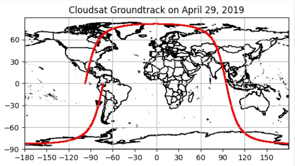
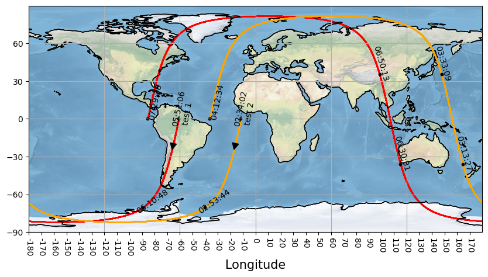
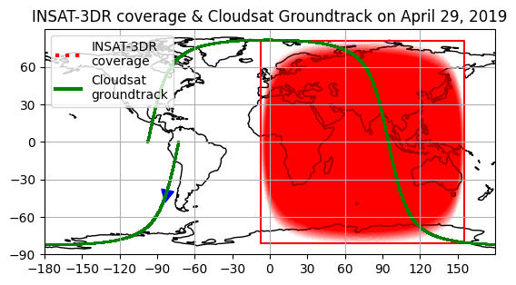

This directory contains various output images of CloudSat orbit(s) and photos about how CloudSat scans the Earth's atmosphere. This is the first step of my work related to CloudSat, which includes plotting groundtracks along with proper time stamps, color coding as per different parameters etc. 

Let's say we want to see the cloud top height as measured by CloudSat during one orbit. We can easily plot it by making the color of the groundtrack, a function of the parameter (here, cloud top height).

- Groundtrack is the path traced on Earth, by a satellite, as it moves along its orbit.

- The instantaneous scanning area of CloudSat is 1.3 km × 1.7 km. A smaller instantaneous scanning area (or pixel size) makes our task a lot simpler, as compared to satellites who do sideways scan. We can call it a unit area/pixel/profile. The official documentation of CloudSat calls this unit area as "profile".

- CloudSat completes 14-15 orbits per day. It traces the exact same groundtrack after an interval of 16 days. Thus, continous surveillance over an area is not possible through CloudSat. So we are trading better resolution for a lack of continous coverage. The better resolution comes from the fact that CloudSat is just 400 km above the Earth's surface, as compared to 36,000 km for geostationary satellites.

Below is a short description of how the CloudSat orbits around the Earth and how it scans the atmosphere.

# Orbit
- Visualization of a single orbit of CloudSat, on a given random day.
  

  

- Visualization of the total cloud thickness, as measured by CloudSat, in a single orbit. The highest total cloud thickness is observed near the equator, which is expected, since the atmosphere is the thickest near the equator.
  

  

- 3D visualization of all CloudSat orbit of a given single day. 

  

- Two CloudSat orbits shown, along with timestamps. All times are in GMT. The timestamps show us where the CloudSat was at what time. This is important while doing the collocation process manually. 

  

- All orbits of CloudSat for one day, in a 2D projection.

  

- A single orbit of CloudSat, superimposed with INSAT-3DR coverage area. (Preliminary version)

  

- All orbits of CloudSat for one day, along with start time and INSAT-3DR satellite's coverage area. [(Code)](https://github.com/DebasishDhal/Thesis_Repository/blob/main/cloudsatorbit/codes/multiple_groundtracks_with_insat_coverage.py)

  

- Below is a distribution of latitude and longitude of datapoints scanned by CloudSat in the month of January, 2019. This is to show that the scanning is not always so uniformly distributed.

# Scanning

- Visulization of how CloudSat scans the Earth's atmosphere. In one orbit, it scans the atmosphere 37,088 times. Each scan/profile is of an area 1.1 km (along the orbit) × 1.7 km (across the orbit).
  Vertically, each scan/profile spans an area from the Earth's surface (0 km) till 30 km of altitude. Each scan/profile is divided into 125 bins, with each bin being 240 m thick. (Photo taken from [ccplot manual](https://ccplot.org/pub/resources/CloudSat/CloudSat%20Data%20Users%20Handbook.pdf))

  

Codes can be found here 

https://github.com/DebasishDhal/Thesis_Repository/blob/main/miscellaneous/csatdatareading.pdf 
 
