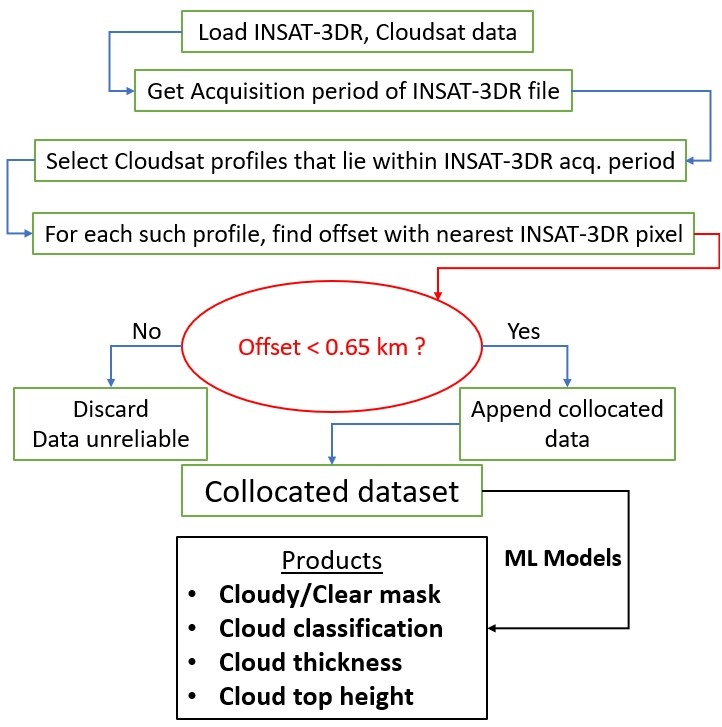

This folder contains the codes for collocation. For the most part, collocation here is defined as collecting radiometric data from INSAT-3DR and cloud-properties data from CloudSat, with a certain tolerable
temporal and spatial offset. The temporal offset is 30 minutes and the spatial offset is 1 km in this case. In fact, the maximum spatial offset is reduced to 0.55 km through filtering, while using
the data. 

The same logic has also been used to collocate Cloud-Mask produced by Indian Meteorological Department with the cloud-properties data from CloudSat. This particular step is for validation of Cloud-Mask from IMD.

# Contents

- Collocation codes are for a single file and for a single day. The single file code takes one CloudSat file and one INSAT-3DR file, produces a map with all the necessary information and asks the user the permission to collocate. Such an image is provided below. In the image below, both the CloudSat and INSAT-3DR files are from the same date. Notice that there is a temporal and spatial overlap between both the coverage area of both the files from 0815 hours till 0841 hours, in between the area from Antarctica till western India. Thus, we can go ahead for the collocation with this particular combination of files. 

  

  <a href="https://github.com/DebasishDhal/Thesis_Repository/blob/minor-patch/cloudsatorbit/codes/cloudsat_groundtrack_insat_coverage_combined.py">Code for this image</a>

Analyzing all these maps is laborious. Hence, this process of choosing the correct combination of CloufSat and INSAT-3DR file has been automated in the single day code. It takes all CloudSat and INSAT-3DR files for one day and does the collocation for all the combinations that match the collocation criteria, i.e. there must be a temporal and spatial overlap between both the files.

Below is the flowchart of the collocation code.

  

- CMK collocation. CMK is short for Cloud Mask, or a geo-referenced file that shows which pixel is cloudy and which is clear. We have CMK files from IMD (Indian Meteorological Department). In order to compare our model's performance with IMD, we need to compare the CMK produced by IMD with CloudSat readings. The CloudSat readings are taken as the truth value since it physically detects clouds through active scanning.
For this, collocating CMK files against CloudSat readings is required.

- SWIR retrival is an error-correction folder. During our main collocation process, I had forgotten to include the SWIR channel in the collocation. Hence, the resulting dataset did not contain any SWIR data. To rectify this, a short script was prepared which will append the SWIR channel data to the dataset. This is more of an array operation as compared to collocation and hence quicker. It took us around one week to be done with this part, where the main collocation took me around 1.5 months.

# Demo

Let's consider a CloudSat file which has just three profiles, with coordinates (-30,80), (0,75) and (30,70). 

-  For each of these coordinates, we find the nearest INSAT-3DR pixel using the formula by first finding out the closes index, then using the index to find out the nearest coordinates
   - distance_array = |csat_lat - insat_lat_array| + |csat_lon - insat_lon_array| (|| denotes absolute value)
   - min_distance = min(|csat_lat - insat_lat_array| + |csat_lon - insat_lon_array|)
   - nearest_index = index_of_min_distance in the array distance_array
   - nearest_insat_lat = insat_lat_array[nearest_index]
   - nearest_insat_lon = insat_lon_array[nearest_index]
- For the given three CloudSat coordinates, the approximate value for the closest INSAT-3DR pixel can be given as: -
   - (-30,80) => (-29.96,80.05)
   - (0,75) => (0.02, 75.01)
   - (30,70) => (30.01,70.03)
     
**Note**: - 1 degree of latitude or longitude represents approximately 110km of distance on Earth's surface. So, (0,75), (0.05, 75.05) might look like these two points are very close to one another, but these two points are 6 km apart from each other. A lot can change within a distance of 6 km of distance. So, it's best to compute the distance and not just go with our general instinct.

For implementation in code, please see line [324,328] (both included) of the code in this [link](https://github.com/DebasishDhal/Thesis_Repository/blob/main/collocations/singlefilecollocation.py#L324).
