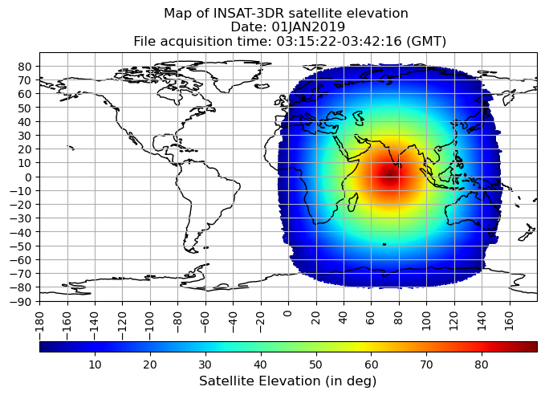
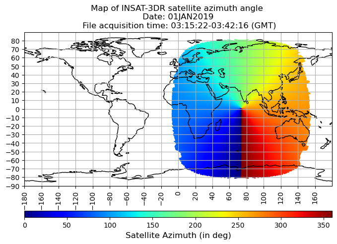
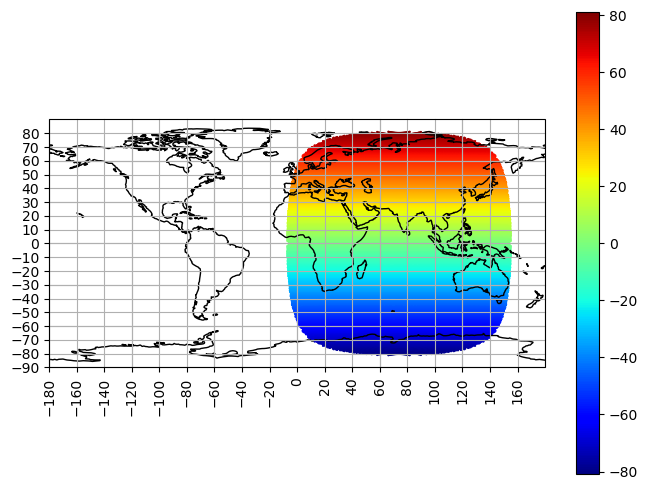
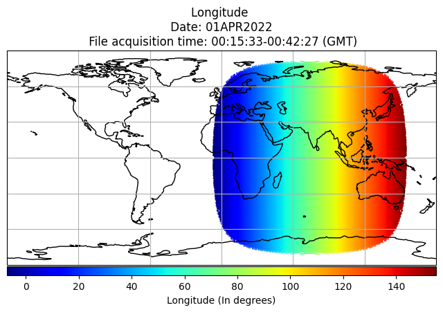
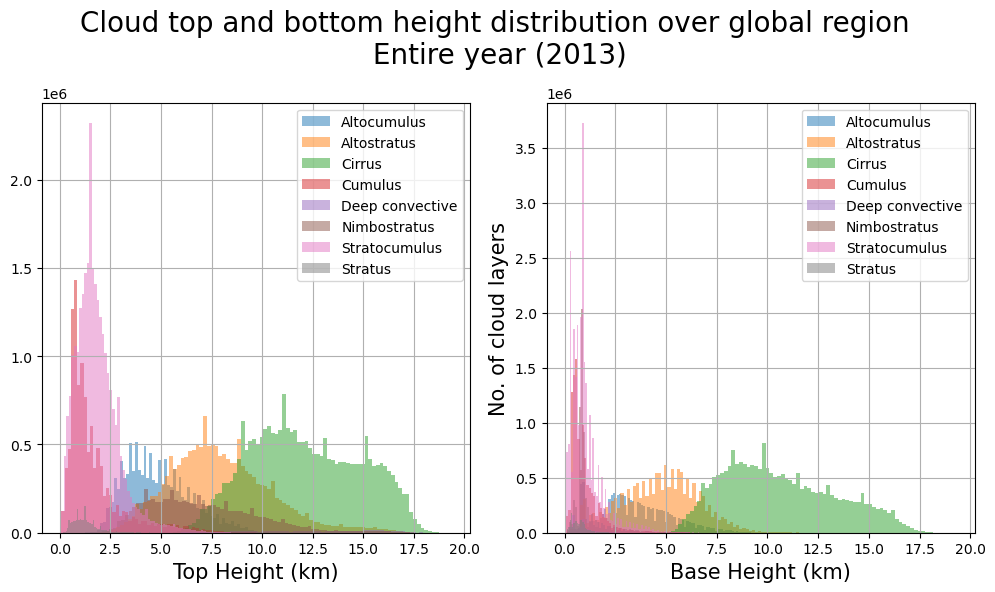
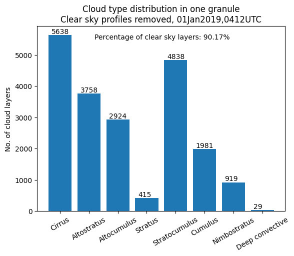
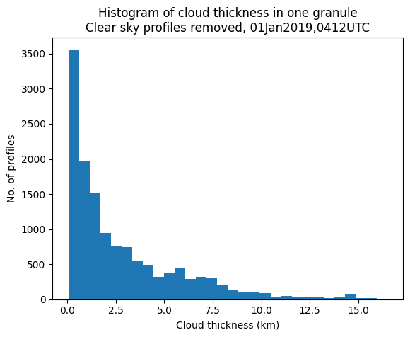

Mostly consists of files and images that were involved in the thesis but were not too important, or they don't fall to any of the categories in the root directory.

- Satellite elevation angle of INSAT-3DR, mapped. An elevation angle of 90 degrees indicates that the satellite is overhead. This distribution of satellite elevation angle stays fixed, since INSAT-3DR is a geostationary satellite. 

  

- Azimuth angle of INSAT-3DR, mapped.

  

- Latitude map (Independent of satellite type, and time of observation)

  

- Longitude map (Independent of satellite type, and time of observation)
  

  

  
- Distribution of cloud top height and cloud bottom height. Time period - Whole year of 2013. Region - Global.

  

- Population of different cloud types, as captured by CloudSat during one orbit. Since this is just for one orbit, it's heavily prone to selection bias. This is just for observation and learning. Cirrus is the most common form of cloud with Deep Convective being the least common.

  

- The distribution of total cloud thickness, as measured by CloudSat during one orbit. Only Cloudy pixels have been considered for this plot. 

  

