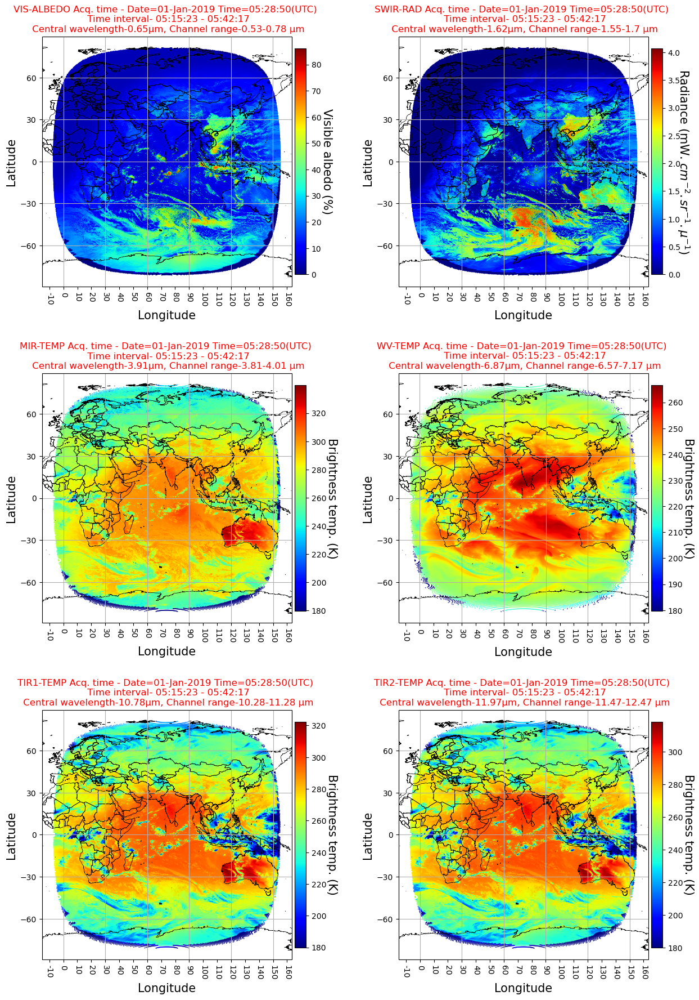

- The two pictures are taken at an interval of exactly six months, at the same GMT. 
It can be observed that the solar elevation angles in the two images are complementary to each other. In the summer solstice period, the sun is centered over the northern hemisphere
while in the winter solstice, it is centered over the southern hemisphere.

  

- Below is a plot for all 6 channels of INSAT-3DR IMAGER. For the first two plots, it's night in the darker part of the globe and day in the brighter parts. Such a sharp contrast is not observed in the rest of the four plots. It's because the first two channels are Visible and Short-wave Infrared Channel, whose most of the contributions come from sunlight reflected from earth. The rest of the four channels are thermal channels, whose most of the contributions come from the thermal waves emitted from the Earth.

  

   

