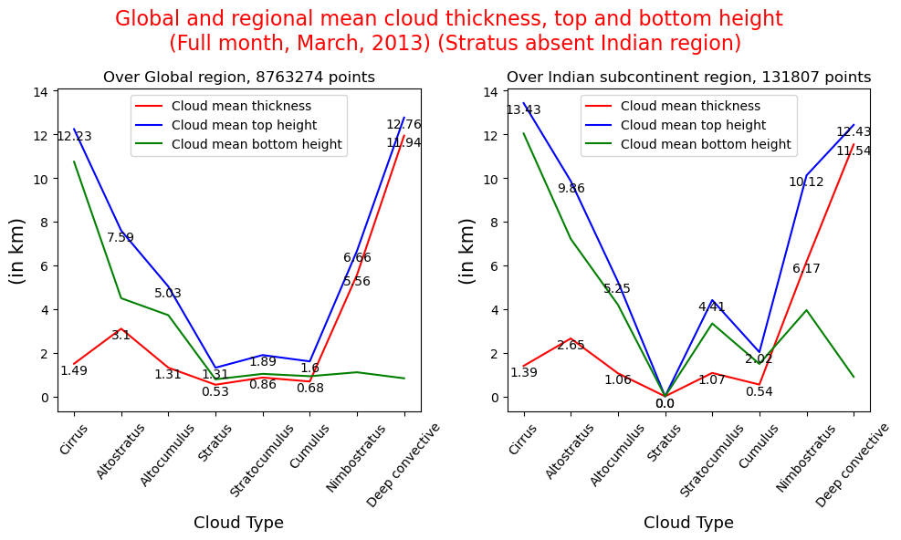
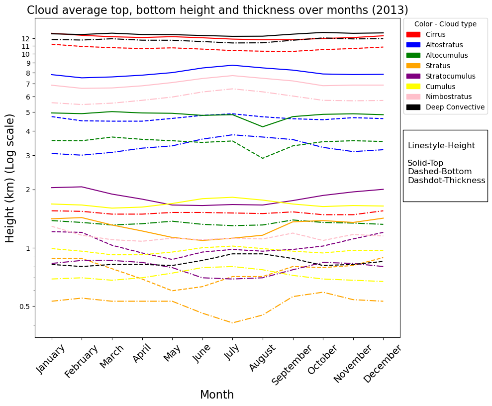

This folder deals with heights of different types of clouds in the year 2013. 3 different heights are being considered, i.e. : -  Base height (height of base of a cloud layer), Top height (height of the roof of cloud layer), Thickness (simply the difference between base and top height).

 <strong>Full year, 2013</strong> 

  

*******************************************************************************************************************************************************************************************

 <strong>January, 2013</strong> 

  

*******************************************************************************************************************************************************************************************

 <strong>February, 2013</strong> 

  

*******************************************************************************************************************************************************************************************

 <strong>March, 2013</strong> 

  

*******************************************************************************************************************************************************************************************

 <strong>April, 2013</strong> 

  

*******************************************************************************************************************************************************************************************

 <strong>May, 2013</strong> 

  

*******************************************************************************************************************************************************************************************

 <strong>June, 2013</strong> 

  

*******************************************************************************************************************************************************************************************

 <strong>July, 2013</strong> 

  

*******************************************************************************************************************************************************************************************

 <strong>August, 2013</strong> 

  

*******************************************************************************************************************************************************************************************

 <strong>September, 2013</strong> 

  

*******************************************************************************************************************************************************************************************

 <strong>October, 2013</strong> 

  

*******************************************************************************************************************************************************************************************

 <strong>November, 2013</strong> 

  

*******************************************************************************************************************************************************************************************

 <strong>December, 2013</strong> 

  

******************************************************************************************************************************************************************************************

 <strong>Change in average top, base height and thickness for different cloud types over the year 2013</strong> 

  

