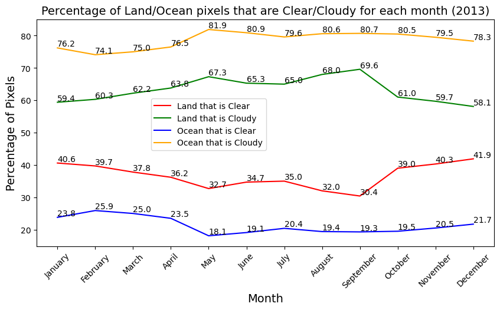

Two types of analysis were done to examine the presence of clouds over land and ocean

- What percentage of land is cloudy and what percentage is clear? What percentage of ocean is cloudy and what percentage is clear? Clearly, here we're analyzing land and oceanic pixels separately. E.g. Out of 100 land pixels and 150 oceanic pixels, 60 land pixels are cloudy, 40 land pixels are clear, while 120 oceanic pixels are cloudy and 30 oceanic pixels are clear.
- Out of all the clear pixels, what percentage of clear pixels lie on land, what percentage lie on ocean? Here, we need to take into account the ratio of total land pixels and total oceanic pixels. E.g. Out of 100 clear pixels and 200 cloudy pixels, 60 clear pixels are over ocean while 40 are over land. Similarly, 150 cloudy pixels are over ocean whille 50 are over land.

The photos are named accordingly, month-wise.

 <strong>Full year, 2013</strong> 

  

    
    

From the first image, over the full duration of the year 2013, 37.1% of land pixels sampled were found to be clear(non-cloudy), while 62.9% of pixels were found to be cloudy. Similarly, only 21.4% of all the ocean pixels sampled were found to be clear, the rest were found to be cloudy.

From the second image, over the full duraiton of the year 2013, 46.5% of all the clear pixels found, happened to be over land. The rest were over oceans. Similarly, 28.6% of all the cloudy pixels found, happened to over oceans/water-bodies. The rest were over land. Since, the area covered by oceans is greater than land-area, a ratio between total oceanic pixels and total land pixels has been provided to help with normalization.

********************************************************************************

 
  <strong>Month-wise Time-Series presence of clouds on Land and Ocean (2013) 
        <a href="https://github.com/DebasishDhal/Thesis_Repository/blob/main/results/cloudsat/cloudpresence/codes/cloud_presence_change_month_wise.py">(Code)</a>
  </strong> 

  

  

********************************************************************************

 <strong>January (2013)</strong> 

  

    
    

********************************************************************************

 <strong>February (2013)</strong> 

    
    

********************************************************************************

 <strong>March (2013)</strong> 

    
    

********************************************************************************

 <strong>April (2013)</strong> 

    
    

********************************************************************************

 <strong>May (2013)</strong> 

    
    

********************************************************************************

 <strong>June (2013)</strong> 

    
    

********************************************************************************

 <strong>July (2013)</strong> 

    
    

********************************************************************************

 <strong>August (2013)</strong> 

    
    

********************************************************************************

 <strong>September (2013)</strong> 

    
    

********************************************************************************

 <strong>October (2013)</strong> 

    
    

********************************************************************************

 <strong>November (2013)</strong> 

    
    

********************************************************************************

 <strong>December (2013)</strong> 

    
    

