Clouds have their own preferred zone of occurence, based on their types. As in, certain clouds tend to dominate the polar regions, while others dominate the tropical regions. This folder contains monthly and yearly plots of which type of clouds dominate at which latitudes. They are shown in this readme file.

  

*******************************************************************************************************************************************************************************************

  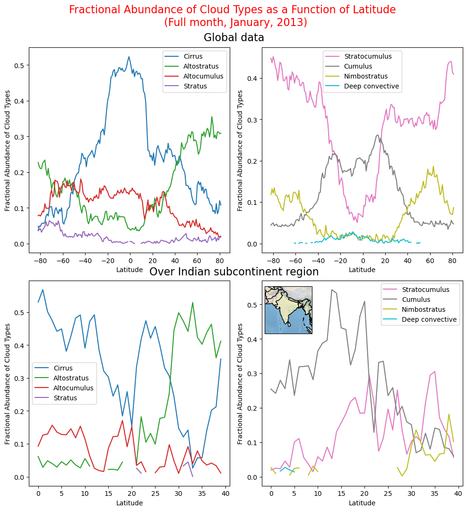

*******************************************************************************************************************************************************************************************

  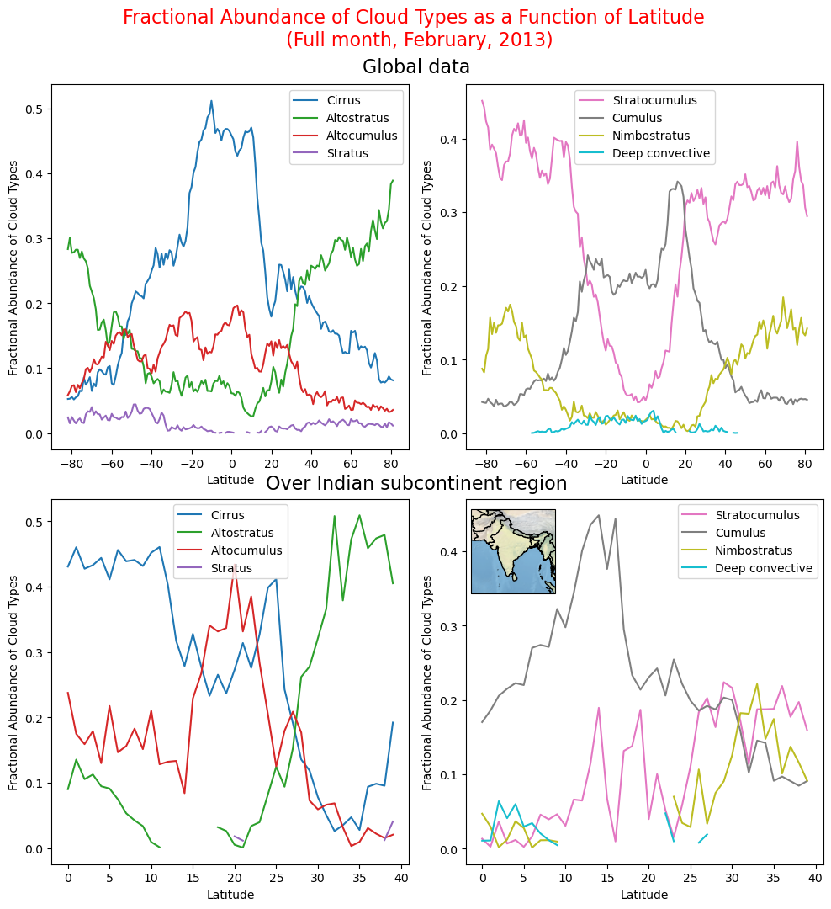

*******************************************************************************************************************************************************************************************

  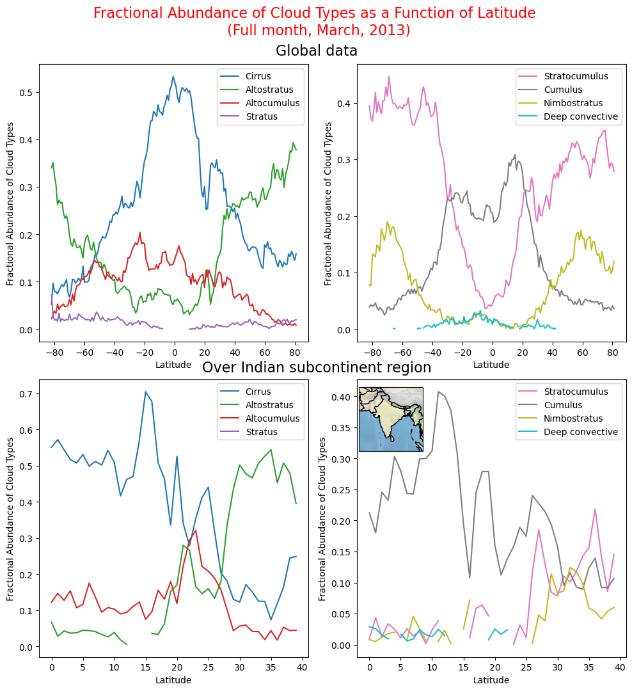

*******************************************************************************************************************************************************************************************

  

*******************************************************************************************************************************************************************************************

  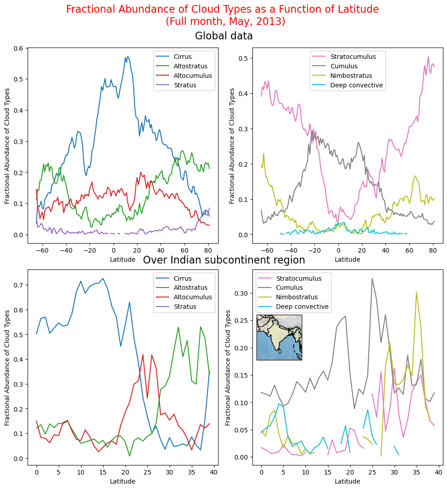

*******************************************************************************************************************************************************************************************

  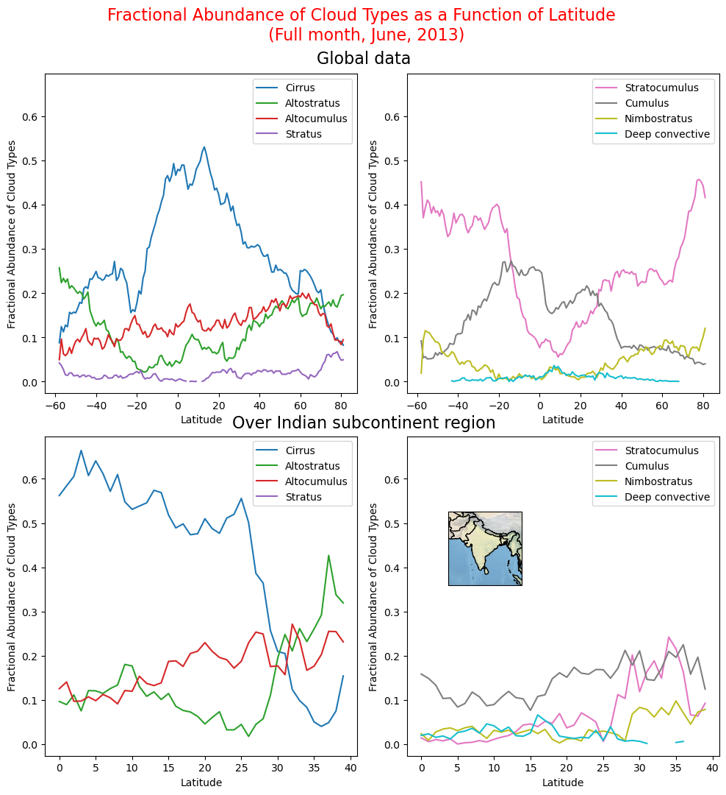

*******************************************************************************************************************************************************************************************

  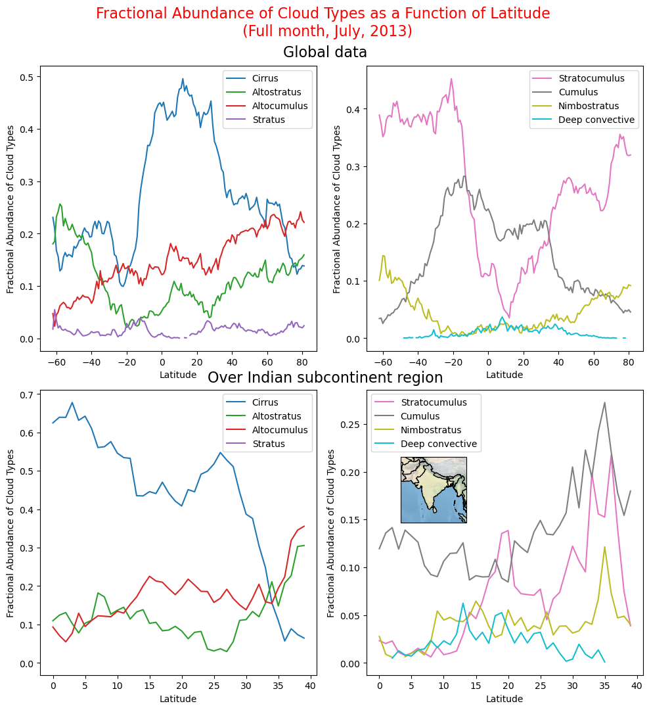

*******************************************************************************************************************************************************************************************

  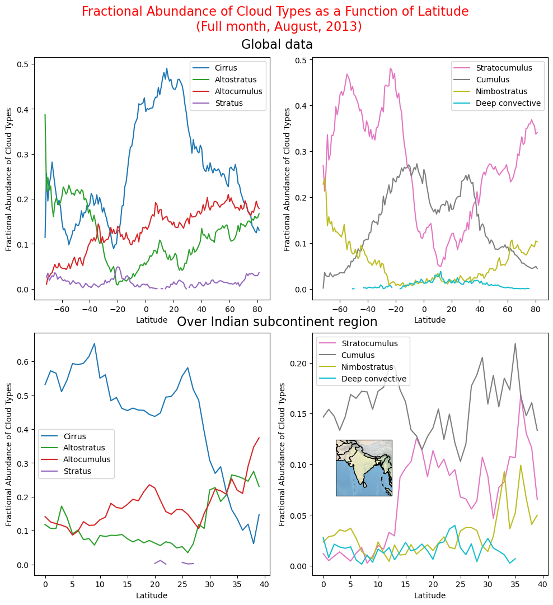

*******************************************************************************************************************************************************************************************

  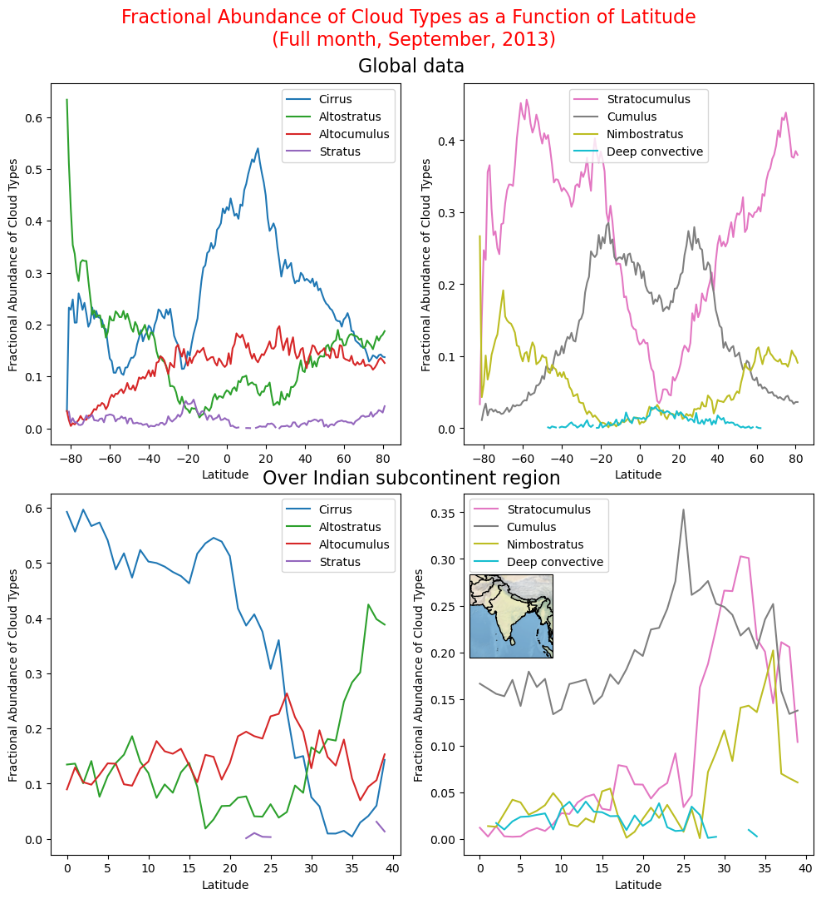

*******************************************************************************************************************************************************************************************

  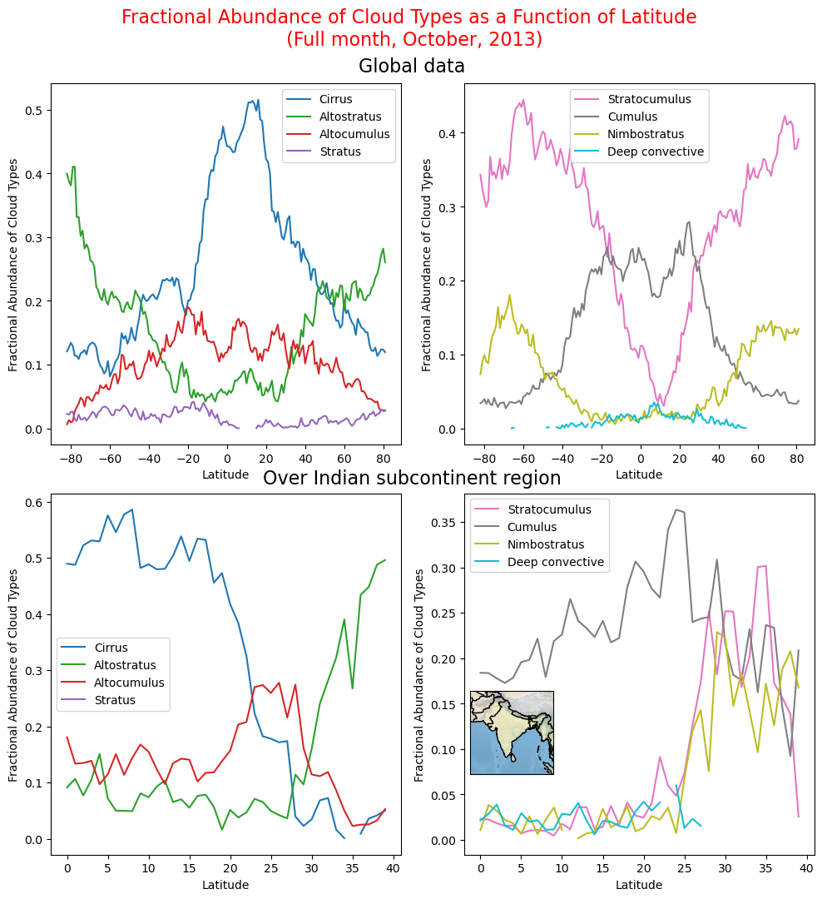

*******************************************************************************************************************************************************************************************

  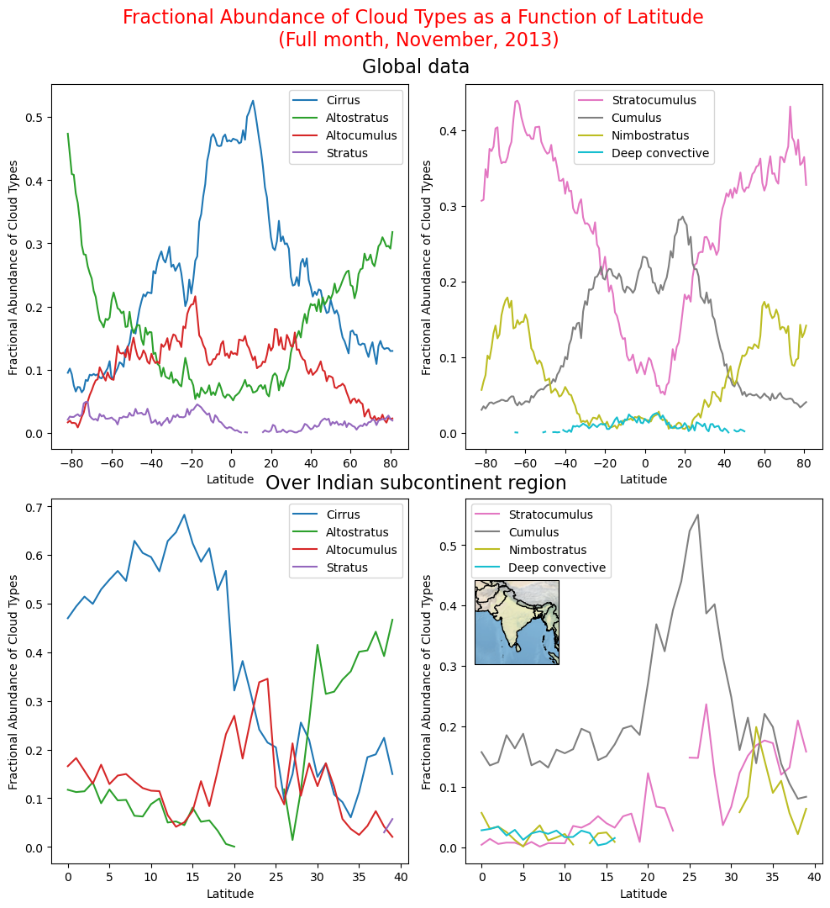

*******************************************************************************************************************************************************************************************

  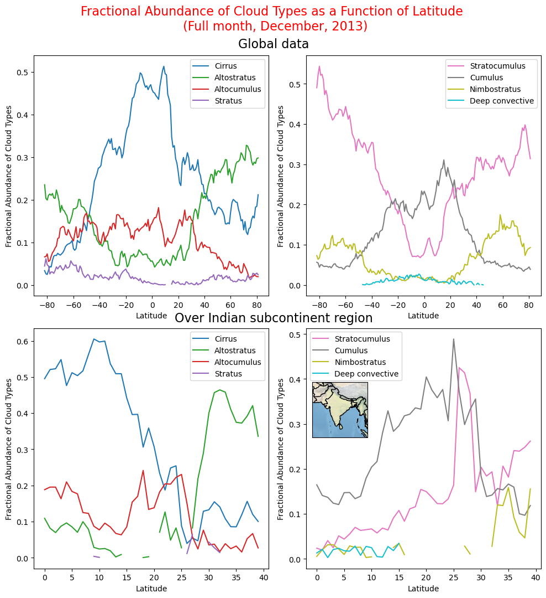

