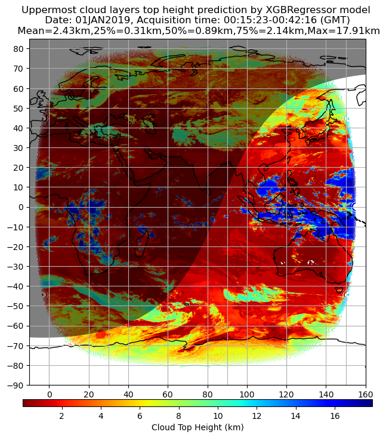
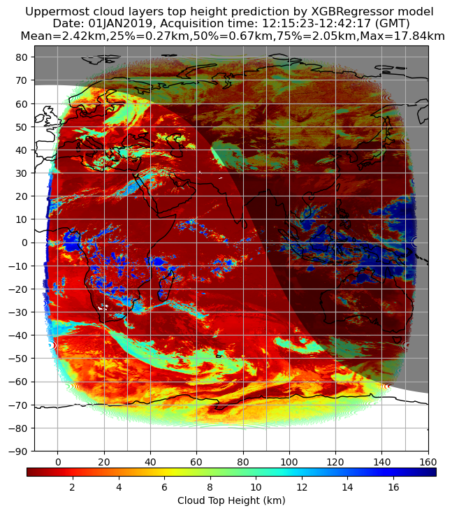
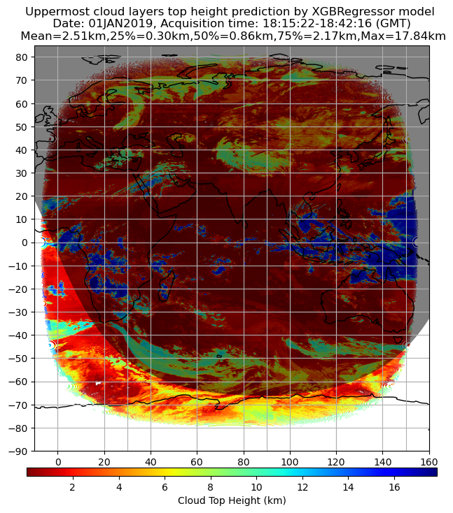
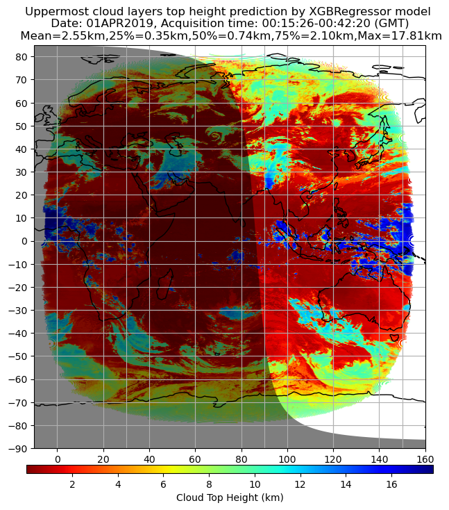
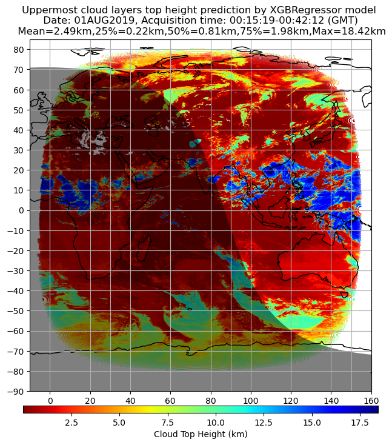
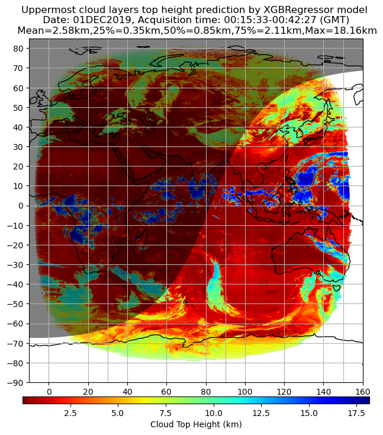

For cloud-top-height, our results are below: -

- Only the Infrared channels of INSAT-3DR (dependent only on the Earth's thermal radiation) were used in this model, so that it can be used both during day and night.
- The model shows a value of 0.95 with a mean squared error of 1.10km in the test set.
- Using this model, it was found that the average global cloud top height is in the range 2-3 km throughout the year.
- The TIR1 channel (10.3-11.3 μm) of INSAT-3DR has the highest importance in the model (69.05).

In this folder, some of the maps produced by using our models have been attached. Note that if in this case, we come across a clear pixel, the cloud top height will either be 0 or very close to 0. 

In this folder, one can find 4 different maps for a particular day and 3 other maps for different months, for comparison.

***************************************************************************

<strong>0015 Hours, Date - 01/January/2019</strong>

  

***************************************************************************

 <strong>0615 Hours, Date - 01/January/2019</strong> 

  

***************************************************************************

 <strong>1215 Hours, Date - 01/January/2019</strong> 

  

***************************************************************************

 <strong>1815 Hours, Date - 01/January/2019</strong> 

  

***************************************************************************

 <strong>0015 Hours, Date - 01/April/2019</strong> 

  

***************************************************************************

 <strong>0015 Hours, Date - 01/August/2019</strong> 

  

***************************************************************************

 <strong>0015 Hours, Date - 01/December/2019</strong> 

  

