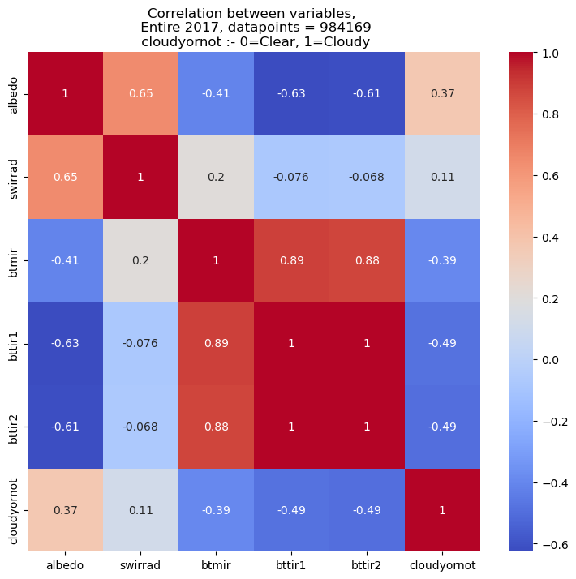

As explained, this shows our prediction vs IMD prediction for cloudy or clear sky conditions for the Indian side of the globe.

In numerical terms, below are our results:

- Day-time model to predict cloudy/clear classification has an overall accuracy of 79.84%, which predicts 71.06% of all clear pixels and 84.95% of the cloudy pixels correctly.
- Night-time model to predict cloudy/clear classification has an overall accuracy of 78.90%, which predicts 73.48% of all clear pixels and 82.18% of the cloudy pixels correctly.
- Separate day and night time models are used since some channels (VIS and SWIR) do not operate at night time, since they are depend on reflected sunlight for their readings.
- Our models are compared with the classification produced by IMD. We cross-checked the classifications of IMD against the observed readings from CloudSat.
- It was found that IMD cloudy/clear classificaion has an overall accuracy of 77.18%, with an accuracy of 74% with clear pixels and 79% with cloudy pixels.

  

<strong>Correlation (Pearson) map of Cloudy/Clear classification with Albedo, SWIR Radiance, MIR, TIR1 and TIR2 Brightness Temperatures</strong>

For comparison, four maps comparing our cloud-mask with IMD's cloud-mask has been presented, for four different times of a given day. Our model tends to overestimate the cloudy pixels, which is prominent especially during the day time. For a full-day version, with one map every 30 minutes, please visit other sub-folders within this folder.

- Time - 0015 Hours, Date - 01/Jan/2019

  

***************************************************************************

- 0065 Hours, Date - 01/Jan/2019

  

***************************************************************************

- 1215 Hours, Date - 01/Jan/2019

  

***************************************************************************

- 1815 Hours, Date - 01/Jan/2019

  

